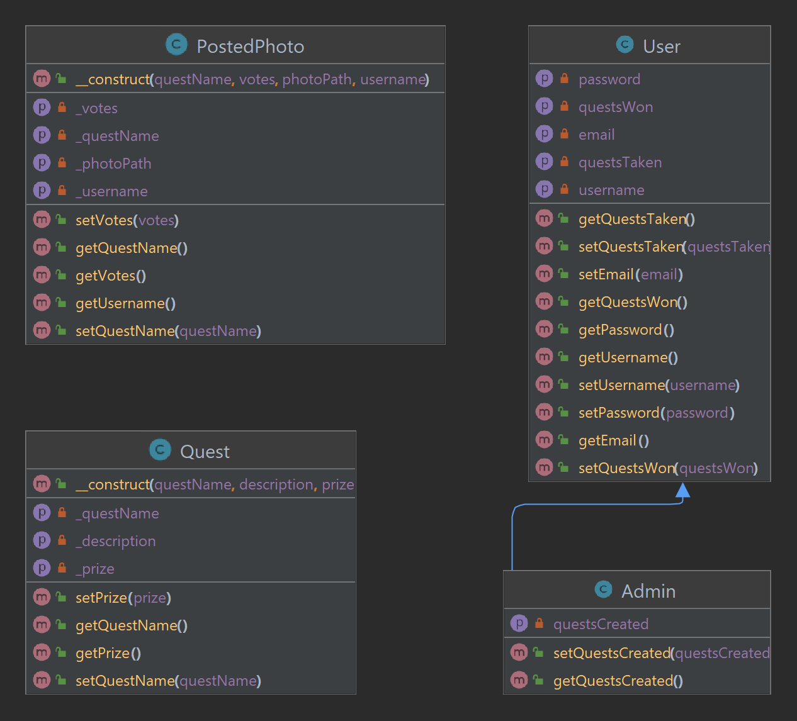

# Project Title: PhotoQuest

## Description
PhotoQuest is a photo competition website where users can participate in challenges by submitting photos based on provided prompts. The prompts can be either travel-related or food-related. For travel prompts, participants are required to travel to the specified location and capture a compelling photo. For food prompts, participants need to prepare the dish and photograph it. All submitted photos are displayed on the competition page, and users can vote for their favorite photo. The winner of each challenge receives a monetary prize that covers the expenses of creating the photo, approximately three times the original cost.

## Authors
- Giang Nguyen
- Viktoriya Kovachyk
- Slavik Khrapach

## Project Requirements Implementation

1. Separation of Database Logic (MVC pattern):
    - Database logic under model folder
    - All HTML files under views folder
    - Routes to all the html files under the index.php
    - index.php calls function in Controller to get data from model and return views.
    - Classes under classes folder
    - JavaScripts under scripts folder

2. URL Routing and Templating (Fat-Free Framework):
    - Utilized the Fat-Free Framework in index.php to route URLs and leverage a templating language for generating dynamic web pages.

3. Database Layer and PDO Prepared Statements:
    - Developed a clearly defined database layer under model in data-layer.php using PDO (PHP Data Objects) and utilized prepared statements to prevent SQL injection attacks.
    - We have 3 tables, accounts, photos, and votes. All of them are related to each other.

4. Data Management:
    - Implemented functionalities to add and view data, including photo submissions, prompts, and user votes.

5. Version Control and Commits:
    - Maintained a Git repository for the project and made regular commits with clear comments. Commits reflect contributions from all three team members.

6. Object-Oriented Programming (OOP) with Inheritance:
    - Utilized OOP principles and incorporated 4 classes.
    - postedPhoto class contains information about the post, such as quest, username, photoPath, and votes.
    - quest class contains fields such as questName, description, and prize.
    - user class contains fields username, email, password, questsTaken, and questsWon.
    - admin class extends user and contain all the fields the user has, and also a questsCreated field.

7. Docblocks and PEAR Standards:
    - Provided full Docblocks (PHPDoc) for all PHP files, adhering to PEAR (PHP Extension and Application Repository) standards.

8. Server-Side Validation:
    - Implemented comprehensive server-side validation using PHP to ensure data integrity and security.

9. Code Quality and Best Practices:
    - Maintained clean, clear, and well-commented code. Adhered to the DRY (Don't Repeat Yourself) principle to avoid redundant code.

10. Adequate Effort for Final Project:
    - Demonstrated sufficient effort and completion of requirements expected for a final project in a full-stack web development course.

11. BONUS: Ajax Implementation:
    - Did not do it.

**Note:** We were unable to implement bonus Requirement 11 (Ajax Implementation) in this project.

## UML Class Diagram

## Admin Login (if applicable)
Username: [Admin Username]
Password: [Admin Password]